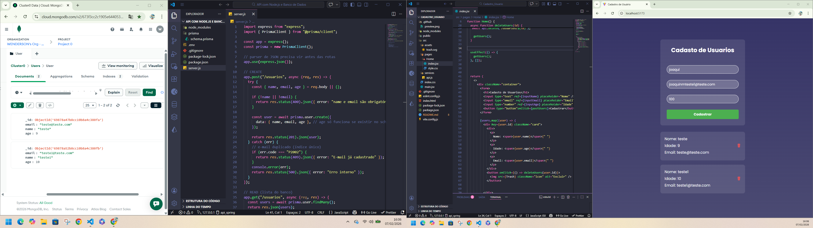

# 📋 Cadastro de Usuários - Frontend

Bem-vindo ao repositório do front-end do projeto **Cadastro de Usuários**. Esta aplicação é uma interface moderna e responsiva desenvolvida em **React 19**, focada na facilidade de gerenciamento de dados de usuários através de uma experiência fluida.

Este projeto compõe a camada de apresentação de um sistema Fullstack, comunicando-se diretamente com uma API RESTful.


> *Nota:  print da tela  ilustrando o projeto.*

---

## 🚀 Tecnologias

As seguintes ferramentas e bibliotecas foram utilizadas na construção deste projeto:

- **[React](https://react.dev/)** (v19) - Biblioteca JavaScript para construção de interfaces.
- **[Vite](https://vitejs.dev/)** - Build tool ultrarrápida para desenvolvimento web moderno.
- **[Axios](https://axios-http.com/)** - Cliente HTTP baseado em Promises para integração com a API.
- **CSS3** - Estilização customizada e responsiva.

---

## ⚙️ Funcionalidades

- **Listagem de Usuários**: Visualização dinâmica de todos os usuários cadastrados.
- **Cadastro de Usuários**: Formulário para inserção de novos registros (Nome, E-mail, Idade).
- **Exclusão de Registros**: Funcionalidade para remover usuários do banco de dados com um clique.
- **Atualização em Tempo Real**: A interface reage instantaneamente às mudanças de estado após as operações da API.

---

## 🔗 Integração com Backend

Este front-end consome uma API Node.js. Para que o sistema funcione completamente, é necessário ter o servidor backend rodando.

🔗 **Repositório do Backend:** [Acesse aqui o código da API](https://github.com/Wendersonjose/crud-node-prisma-mongodb)
*(Node.js + Express + Prisma + MongoDB)*

---

## 📦 Como rodar o projeto

Siga os passos abaixo para executar o projeto em sua máquina local:

### Pré-requisitos
- Node.js instalado (versão 18 ou superior recomendada).
- Backend rodando na porta `3000` (ou ajuste a URL em `src/services/api.js`).

### Passo a passo

1. **Clone o repositório**
   ```bash
   git clone https://github.com/Wendersonjose/crud-react-vite-frontend.git
   ```

2. **Entre na pasta do projeto**
   ```bash
   cd Cadastro_Usuario
   ```

3. **Instale as dependências**
   ```bash
   npm install
   ```

4. **Execute o servidor de desenvolvimento**
   ```bash
   npm run dev
   ```

5. O projeto estará rodando em `http://localhost:5173`.

---

## 📂 Estrutura de Pastas

```
src/
├── assets/        # Imagens e ícones estáticos
├── pages/         # Páginas da aplicação
│   └── Home/      # Página principal e lógica de CRUD
├── services/      # Configuração do cliente HTTP (Axios)
└── main.jsx       # Ponto de entrada da aplicação React
```

---

## 🛠 Melhoras Futuras (Roadmap)

- [ ] Implementar edição de usuários (PUT route).
- [ ] Adicionar validação de formulários com React Hook Form / Zod.
- [ ] Implementar feedback visual (Toast notifications) para sucesso/erro.
- [ ] Criar testes unitários para componentes.

---

## 👨‍💻 Autor

Desenvolvido por **Wenderson**.

[](https://www.linkedin.com/in/wenderson-jose) 
[](mailto:seuemail@gmail.com)
